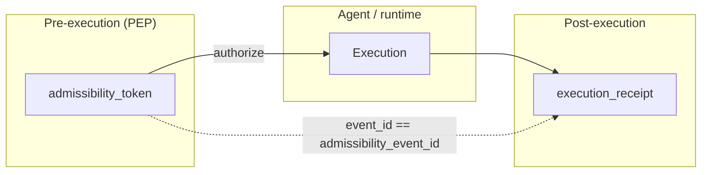
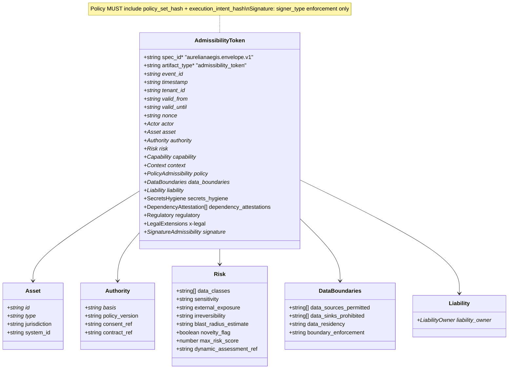
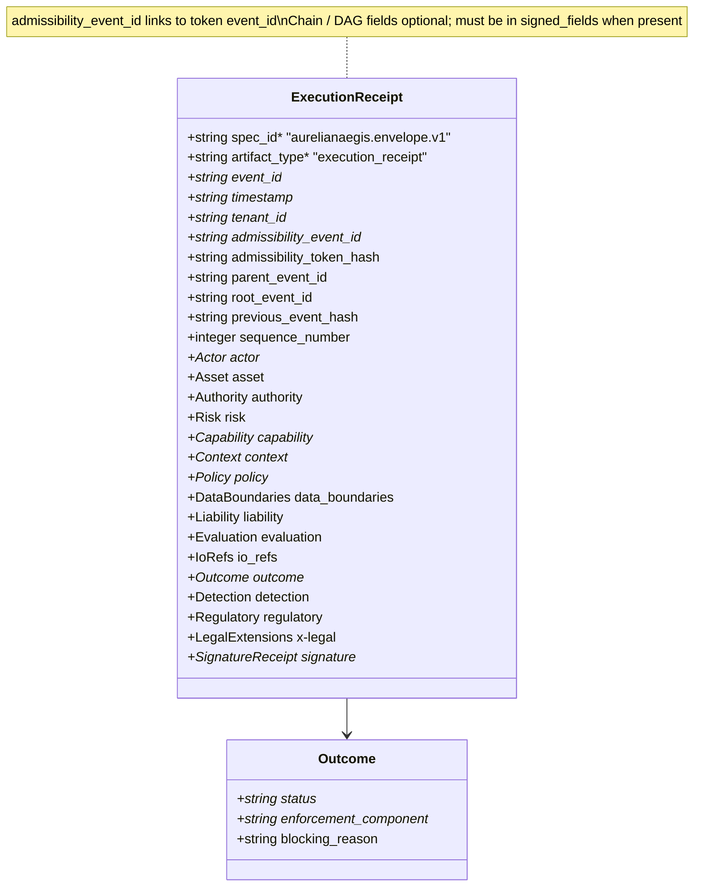

# AurelianAegis Attestation Envelope — Schema Diagram

**Canonical schema:** [attestation-envelope.json](./attestation-envelope.json) (`$id`: `https://aurelianaegis.io/schema/attestation-envelope.json`)

The envelope splits **pre-execution** governance (`**admissibility_token`**) from post-execution evidence (`**execution_receipt`**). The root schema is a `**oneOf**` over those two definitions. Payloads carry stable `**spec_id**` `aurelianaegis.envelope.v1` (unchanged across additive releases). Shared sub-schemas (e.g. `Actor`, `Capability`, `Policy`) live under `definitions` in the JSON Schema file.

---

## Flow Overview (PEP → execution → receipt)

- `**admissibility_token**`: Signed by PEP (`signature.signer_type` = `enforcement` only). Carries **no** `outcome`, **no** `io_refs` — only claims needed before side effects (`valid_from` / `valid_until` / `nonce`, `asset`, `authority`, `risk`, `data_boundaries`, `liability`, `policy` with `policy_set_hash` + `execution_intent_hash`).
- `**execution_receipt`**: Records what happened after execution; **must** include `admissibility_event_id` referencing the token’s `event_id`. May include chain fields, `outcome`, `io_refs`, `evaluation`, `detection`, `regulatory`.

---

## Class Diagram — Admissibility Token (pre-execution)

---

## Class Diagram — Execution Receipt (post-execution)

---

## Signature profiles

| Artifact              | Definition               | `signer_type`                                  | Must include in payload (minimum)                                                                                                                                                                                                 |
| --------------------- | ------------------------ | ---------------------------------------------- | --------------------------------------------------------------------------------------------------------------------------------------------------------------------------------------------------------------------------------- |
| `admissibility_token` | `SignatureAdmissibility` | `enforcement` only                             | `/spec_id`, `/artifact_type`, `/event_id`, `/timestamp`, `/tenant_id`, `/valid_from`, `/valid_until`, `/nonce`, `/actor`, `/asset`, `/authority`, `/risk`, `/capability`, `/context`, `/policy`, `/data_boundaries`, `/liability` |
| `execution_receipt`   | `SignatureReceipt`       | `enforcement`, `control_plane`, or `detection` | Includes `/outcome`, `/admissibility_event_id`. See [SIGNING.md](../spec/SIGNING.md) §4                                                                                                                                           |

---

## Evolution

Additive changes extend the JSON Schema without changing `spec_id`. Breaking changes would introduce a new `spec_id` (e.g. `aurelianaegis.envelope.v2`) and a migration; see [spec.json](./spec.json) and [CHANGELOG.md](../CHANGELOG.md).