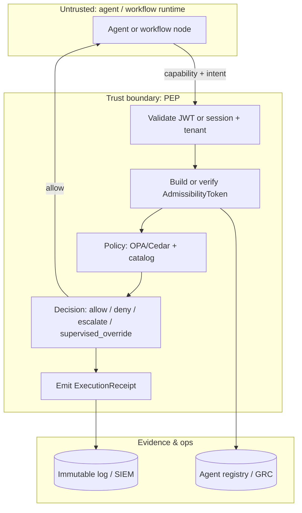
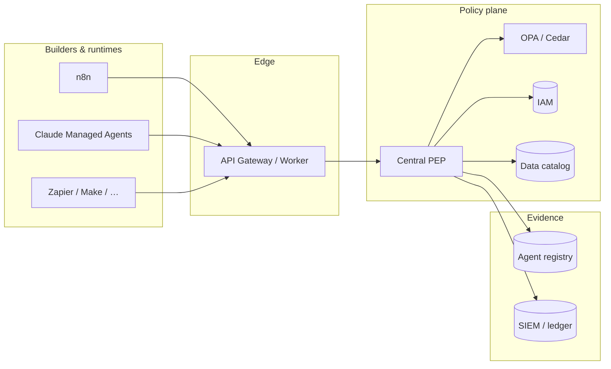

# Enforcing the AurelianAegis Attestation Envelope on n8n, Claude Managed Agents, and Similar No-Code / Low-Code Platforms

**Audience:** CISO, Head of AI Governance, platform engineering, and enterprise architects who own the **policy plane** above infrastructure—authorization, explicit **data boundaries**, and **liability mapping**—not merely model choice or prompt hygiene.

**Schema baseline:** [attestation-envelope.json](../../schema/attestation-envelope.json) (`spec_id` `aurelianaegis.envelope.v1`) — root `oneOf`: `admissibility_token` (pre-execution) + `execution_receipt` (post-execution). The **agent does not sign** admissibility; the **PEP (Policy Enforcement Point)** does (`signature.signer_type` = `enforcement` on the token). See [SIGNING.md](../SIGNING.md).

---

## Executive thesis

Tools such as **n8n**, **Claude Managed Agents** (Anthropic’s enterprise hosted runtime with managed controls), **Zapier**, **Make.com**, **CrewAI**, and **LangGraph** are **high-risk shadow-AI vectors**: they let non-developers ship agents and workflows that bypass traditional IAM rigor, SBOM discipline, and uniform runtime policy. Without **pre-execution enforcement**, organizations accumulate untracked **data exfiltration paths**, **unowned liability**, and gaps against **EU AI Act** and **NIST AI RMF** expectations for traceability and human oversight.

**This schema is designed for this split:** a **cryptographically signed, short-lived `admissibility_token`** must exist **before** any tool call, webhook, or state-mutating step. **Shadow agents** are detected and forced into a **registration / remediation** loop; receipts carry `detection` semantics and optional `signer_type: detection` where appropriate. This document describes a **production-ready enforcement strategy** that works **without** waiting for native vendor schema support: **central PEP + gateway proxy + telemetry-backed registry**.

---

## 1. Why these platforms are different

| Factor         | Traditional app           | No-code / managed agent                     |
| -------------- | ------------------------- | ------------------------------------------- |
| Identity       | Service principals, CI/CD | Personal accounts, OAuth, ad-hoc connectors |
| Change control | PRs, scans                | Publish in UI                               |
| Data path      | Known APIs                | Webhooks, browser, SaaS glue                |
| Audit          | CMDB-linked               | Often missing from asset inventory          |

The schema does not replace IAM; it **binds** policy decisions and outcomes to **agent identity**, **asset**, **authority**, **risk**, **data_boundaries**, and **liability** so that **every** governed execution is **provable** in the same envelope model.

---

## 2. Core enforcement pattern (universal)

Deploy a **central PEP** that **issues and validates** `admissibility_token` payloads and **emits** `execution_receipt` records. Implement policy evaluation with **OPA/Rego**, **Cedar**, or equivalent; deploy at the **data path** via **service mesh** (Envoy, Istio), **API gateway** (Kong, Apigee, AWS API Gateway), or a **lightweight sidecar** co-located with the integration runtime.

**Invariant:** Every agent tool invocation, outbound webhook, and state-changing API call is **routed through** the PEP (or a PEP-backed proxy). **No valid token → deny** and, where configured, **shadow detection** + alert to your **AI Trust / agent registry** pipeline.

### 2.1 What the PEP does on each invocation

1. **Verifies** the `admissibility_token` (signature, `valid_from` / `valid_until`, `nonce`, `tenant_id`, `actor` passport rules).
2. **Evaluates** `data_boundaries`, `liability.liability_owner`, `risk` (including optional `max_risk_score`, `dynamic_assessment_ref`), `secrets_hygiene`, `dependency_attestations` against enterprise policy and data catalog (e.g. Collibra).
3. **Returns** allow / deny / escalate / `supervised_override` (see `policy.decision` and `policy.oversight_mode`).
4. **After** execution, **emits** `execution_receipt` with `outcome`, `io_refs`, `admissibility_event_id` = URN of the token’s `event_id`, and optional **chain** fields per [CHAIN-INTEGRITY.md](../CHAIN-INTEGRITY.md).

### 2.2 Schema mapping: “PEP checks” → envelope fields

| PEP concern                | Primary envelope fields                                                                                            |
| -------------------------- | ------------------------------------------------------------------------------------------------------------------ |
| What is being touched?     | `**asset`**, `**capability**`, `**capability.is_state_mutating**`                                                  |
| Legal / policy basis       | `**authority**`, `**policy**`, `**policy.policy_set_hash**`, `**policy.execution_intent_hash**`                    |
| Data exfil / residency     | `**data_boundaries**`, `**risk**`, `**secrets_hygiene**`                                                           |
| Who owns the blast radius? | `**liability**`, `**x-legal**` (e.g. `**registered_agent**`)                                                       |
| Human oversight            | `**policy.decision**`, `**policy.oversight_mode**`, `**evaluation**`                                               |
| Post-hoc proof             | `**execution_receipt**`, `**io_refs**`, `**outcome**`                                                              |
| Shadow / unregistered      | `**detection**`, `**actor.registration_status**`, receipt `**signature.signer_type**`: `detection` when applicable |

---

## 3. Platform-specific enforcement

### 3.1 n8n (self-hosted or cloud)

n8n’s **AI Agent** node, **webhooks**, and **integrations** are classic **shadow** vectors (supply-chain and workflow exposure is a recurring theme in security advisories—treat the category as **high risk**). There is **no** native pre-execution attestation, but **extensibility** makes enforcement practical.

**Primary pattern — Custom node + PEP**

- Ship or adopt a **“Governance Guardrail”** node (or sub-workflow) that:
  - Builds **execution intent** (`capability`, `parameters`, `**asset`**).
  - Calls the **PEP** to obtain or validate a **short-lived `admissibility_token`**.
  - **Blocks** downstream AI/tool nodes unless `**policy.decision`** is `**allow**` (or allowed `**supervised_override**` path).

**Webhook / form trigger pattern**

- Front **public** webhooks and forms with an **API gateway** or **edge worker** (e.g. Kong, Envoy, Cloudflare Workers).
- Gateway validates the token (or exchanges opaque session for token) and forwards to n8n with a stable header such as `**X-AurelianAegis-Token-Ref`** (opaque) or signed JWT carrying `**event_id**`—**never** long-lived secrets in the workflow JSON.

**Self-hosted hardening**

- Run n8n **behind** mesh or egress proxy so **all** outbound tool calls pass PEP.
- Align **n8n credential vault** usage with `**secrets_hygiene`**; block plaintext API keys in nodes via policy + scanning.

**Shadow detection**

- Ingest n8n **API / audit / execution logs** into a **discovery** pipeline.
- Workflows using **unregistered** AI paths trigger `**detection_method`**: `telemetry_shadow` (or equivalent) and a **remediation_status** workflow: approve/register → `**converted_to_governed_asset_id`** or decommission.

### 3.2 Claude Managed Agents (Anthropic hosted enterprise runtime)

Anthropic’s **enterprise** tier provides **audit logs**, **RBAC**, **sandboxing**, and **control-plane** features—useful **necessary** controls, but **not** a substitute for your **attestation envelope** evidence line. Enforcement remains **API- and proxy-centric**.

**Primary pattern — API proxy + guardrails**

- Route **all** Claude Agent **tool** invocations through your **enterprise reverse proxy** (or vendor guardrail hook if exposed in your contract).
- Proxy **mints or validates** `**admissibility_token`** immediately **before** each tool call.
- Inject or verify `**data_boundaries`**, `**liability**`, and `**risk**` claims from your catalog; keep **memory / tool isolation** on the Anthropic side as **defense in depth**, not as the audit record of record.

**Control panel alignment**

- Map **governance profiles** to team roles and retention; drive `**supervised_override`** and **human-in-the-loop** from `**policy.oversight_mode`** and `**evaluation**`.

**Shadow detection**

- Correlate **Anthropic usage logs** with **network egress** and **unmanaged** API keys.
- Unmanaged paths feed the same **shadow attestation** pipeline: discovery → `**remediation_status`** → governed `**asset.id**`.

### 3.3 Other no-code platforms (Zapier, Make.com, CrewAI, LangGraph, …)

| Situation                                    | Approach                                                                                         |
| -------------------------------------------- | ------------------------------------------------------------------------------------------------ |
| Has custom code / webhooks                   | **Governance webhook** first: only invoke Zap/Make after PEP `**allow`**.                        |
| Pure SaaS, limited hooks                     | **Egress gateway** + **DLP** + **registry** correlation; treat as **shadow** until wired to PEP. |
| Code-first orchestration (CrewAI, LangGraph) | **SDK/sidecar** at orchestration boundary: same token/receipt flow as microservices.             |

**Rule of thumb:** If the platform cannot run your node, **wrap the trigger**: the **first** network hop is the PEP.

---

## 4. Operational rollout (what to deploy in order)

| Phase                                        | Scope                                                                    | Outcome                                                         |
| -------------------------------------------- | ------------------------------------------------------------------------ | --------------------------------------------------------------- |
| **1 — Central PEP** (typ. 1–2 weeks for MVP) | Rego/Cedar + signing keys + validation of full `**admissibility_token`** | Single source of truth for allow/deny                           |
| **2 — Shadow discovery**                     | Scan n8n, Claude logs, egress; correlate to registry                     | `**detection`** records with `**telemetry_shadow**` etc.        |
| **3 — Registration workflow**                | Intake → risk → disposition → `**actor.agent_id`** + passport            | Shadow → **governed** asset                                     |
| **4 — Platform onboarding**                  | n8n guardrail node; Claude proxy; gateway for SaaS                       | PEP on **data path**                                            |
| **5 — Observability & audit**                | SIEM + immutable ledger; `**execution_receipt`** per run                 | CFO/COO loop via `**context.cost**`, `**business_outcome_ref**` |

---

## 5. Why this works: liability-first architecture

1. **Pre-execution gate:** No tool call or state change without a **valid signed** `**admissibility_token`** (PEP-signed, short-lived).
2. **Boundaries and ownership:** `**data_boundaries`** and `**liability**` are **signed** claims **before** action—evidence, not after-the-fact narrative.
3. **Shadow AI:** Telemetry-backed discovery removes the **“we did not know”** defense; `**detection`** and registry workflows create **accountability**.
4. **Standards alignment:** Evidence packs map to **OAP-style** passport concepts, **lifecycle** references on `**actor`**, and regulatory field mapping in [REGULATORY-FIELD-MAPPING.md](../REGULATORY-FIELD-MAPPING.md).
5. **Vendor-independent:** If a vendor ships native support later, your **PEP and ledger** remain the **system of record**.

---

## 6. Reference architecture (PEP ↔ platforms ↔ registry)

---

## 7. Appendix A — Rego policy outline (PEP)

This is **not** a drop-in policy library; it is the **shape** of rules teams implement against their **bundle URIs** and **tenant** layout.

- **Package:** `aurelianaegis.admissibility`
- **Input:** Parsed `**admissibility_token`** JSON (post-signature verification) + **tenant** context + **catalog** facts (residency, sensitivity).
- **Deny** examples:
  - `data_boundaries.data_sinks_prohibited` intersects **actual** sink from intent.
  - `risk.sensitivity` = `restricted` and `policy.oversight_mode` not in allowed set.
  - `secrets_hygiene` indicates **hardcoded_secret** when `policy` requires vault-only.
- **Allow with obligations:** emit `**supervised_override`** when `risk.max_risk_score` > threshold and `**evaluation.human_involved**` will be required on receipt.

Pair with **OPA’s** JWT helper if the transport uses signed **opaque** references to `**event_id`**.

---

## 8. Appendix B — Guardrail node contract (n8n-style)

A minimal **interface** for a custom node (any language) that teams implement against their PEP:

| Step    | Responsibility                                                                                                   |
| ------- | ---------------------------------------------------------------------------------------------------------------- |
| Collect | `**capability.id`**, `**parameters**`, `**asset**`, `**context.correlation_id**`                                 |
| Request | `POST /pep/v1/admissibility` → `**admissibility_token**` (or cached handle)                                      |
| Gate    | If `**policy.decision**` ∉ {`allow`, approved `supervised_override` path} → **stop** workflow                    |
| Execute | Run AI/tool step                                                                                                 |
| Report  | `POST /pep/v1/receipt` → `**execution_receipt`** with `**admissibility_event_id**`, `**outcome**`, `**io_refs**` |

Use **workflow-level** secrets for PEP client credentials; never embed in exported JSON.

---

## 9. Appendix C — Further reading (repository)

| Topic                                             | Document                                                                                   |
| ------------------------------------------------- | ------------------------------------------------------------------------------------------ |
| LangGraph, CrewAI, Strands, universal PEP pattern | [universal-enforcement-agentic-platforms.md](./universal-enforcement-agentic-platforms.md) |
| Signing and `**signed_fields`**                   | [SIGNING.md](../SIGNING.md)                                                                |
| Hash chain / deletion detection                   | [CHAIN-INTEGRITY.md](../CHAIN-INTEGRITY.md)                                                |
| SIEM / GRC ingestion                              | [INTEGRATION.md](../INTEGRATION.md)                                                        |
| Field vocabulary                                  | [VOCABULARY.md](../VOCABULARY.md)                                                          |
| Structure diagrams                                | [attestation-envelope-diagram.md](../../schema/attestation-envelope-diagram.md)  |

---

## 10. Closing note

No-code and managed-agent platforms are **not** going away; neither is the **requirement** for **pre-execution authorization** and **post-execution proof**. The envelope schema makes that split **explicit** and **portable**. The enforcement pattern here—**central PEP, gateway-first routing, registry-backed shadow control**—is what scales to **large** regulated enterprises **today**, independent of whether each SaaS vendor ever adopts the schema natively.