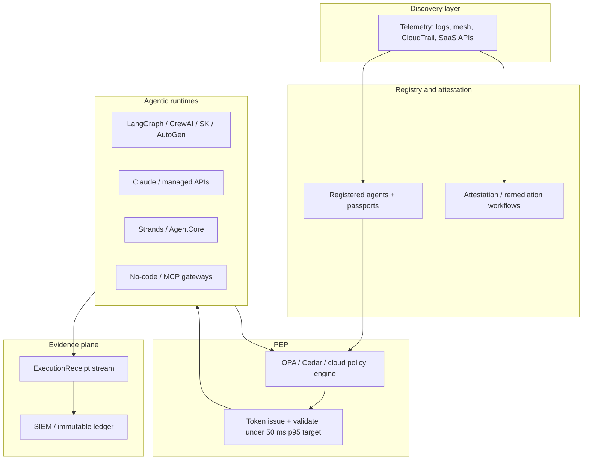

# Universal Enforcement Patterns for Agentic Platforms

**Audience:** Executives and principal engineers who own the **governance layer above infrastructure**—the **policy plane** that owns **authorization**, **explicit data boundaries**, and **liability mapping** before any agent action creates risk.

**Schema baseline:** [AurelianAegis Attestation Envelope](../../schema/attestation-envelope.json) (`spec_id` `aurelianaegis.envelope.v1`) — `admissibility_token` (PEP-signed, pre-execution) and `execution_receipt` (post-execution, linked by `admissibility_event_id`). Normative signing rules: [SIGNING.md](../SIGNING.md).

*Vendor APIs, product names, and release timelines cited below illustrate integration patterns; verify current capabilities against each vendor’s documentation before production design.*

---

## Abstract

Agentic platforms—**code-first** (LangGraph), **role-based** (CrewAI), **Microsoft-ecosystem** (AutoGen, Semantic Kernel), **managed** (Claude), **AWS-native** (Strands on Bedrock), or **no-code**—share one failure mode: **tool calls and graph transitions execute faster than governance can prove intent**. The **universal enforcement pattern** is not “more logging after the fact.” It is a **single, portable contract**: a **short-lived, cryptographically signed `admissibility_token`**, evaluated by a central PEP in tens of milliseconds, before execution; then an `execution_receipt` that binds **outcome**, **I/O references**, and **chain** evidence. **Shadow and unregistered agents** are discovered by telemetry and forced into **attestation → register or quarantine**—so “we did not know that agent existed” ceases to be a defensible posture.

This article lays out that pattern once, then maps it to **2026-era** platform realities: where to **hook**, what to **reuse** (OPA, Cedar, service mesh, cloud policy engines), and why **AWS Strands + Bedrock AgentCore** can offer the **deepest native alignment** for regulated enterprises already on AWS.

---

## 1. The universal enforcement pattern

### 1.1 Central PEP (Policy Enforcement Point)

Implement the PEP with **policy-as-code**—typically **OPA/Rego** or **Cedar**—or with **cloud / framework policy engines** where they sit on the **data path** (e.g. mesh filters, API gateways, managed agent runtimes). Some enterprises also integrate **agent governance toolkits** (including patterns from the **Microsoft** ecosystem) where those toolkits expose a **pre-execution** decision API compatible with your token format.

**Performance target:** Validate the `admissibility_token` (signature, TTL, required claims) and evaluate **policy** in **on the order of <50 ms** for interactive workloads—often faster when tokens are **cached** per short TTL and **intent hash** is stable.

### 1.2 Hook integration — intercept everything that matters

**Hooks must cover:**

- Every **tool call** / function invocation  
- Every **graph node** transition that can invoke tools or mutate state  
- Every **MCP** tool exposure (treat MCP as **another** tool surface)  
- Every **agent-to-agent** handoff that could expand blast radius

If a path can move data or change state **without** passing the PEP, it is **out of policy**—not a “minor exception.”

### 1.3 Token flow (normative behavior)


| Phase                        | What happens                                                                                                                                                                                                                                                                                                                        |
| ---------------------------- | ----------------------------------------------------------------------------------------------------------------------------------------------------------------------------------------------------------------------------------------------------------------------------------------------------------------------------------- |
| **Before execution**         | Runtime **requests** a new `admissibility_token` from the PEP, or **presents** a still-valid, short-lived token bound to `execution_intent_hash` and `policy_set_hash`. Payload carries `actor`, `asset`, `authority`, `risk`, `data_boundaries`, `liability`, and `policy` per the schema. |
| **PEP evaluates**            | Returns `policy.decision`: allow / deny / escalate / `supervised_override` (and maps to operational behavior).                                                                                                                                                                                                              |
| **On allow**                 | Proceed with execution; then **emit** `execution_receipt` with `outcome`, `io_refs` (including `tool_calls` where applicable), `admissibility_event_id` pointing at the token’s `event_id`, optional **chain** fields per [CHAIN-INTEGRITY.md](../CHAIN-INTEGRITY.md).                                      |
| **On deny or invalid token** | Block execution; optionally emit a **detection / remediation** path with `**detection_method`** (e.g. telemetry-driven) and feed **registry** workflows.                                                                                                                                                                            |


**Critical trust property:** The **agent runtime does not sign** the admissibility record; the **PEP** does (`signature.signer_type` = `enforcement` on the token). That preserves a **clear liability boundary**: policy and cryptography meet **above** the untrusted model.

### 1.4 Shadow and unregistered agents — AI Trust OS–style control loop

**Discovery** continuously scans runtimes, logs, identity systems, and **network egress** for agents and workflows **not** present in the **registry** (or present with **stale** passports).

**Response** is not optional “cleanup”: it is a **governance workflow**—**attestation** (who, what data, what risk), **disposition** (approve/register, **quarantine**, decommission), and **evidence** in `**execution_receipt`** with `**signer_type`**: `**detection**` where appropriate. Successful remediation can converge on `**converted_to_governed_asset_id**` and a **governed** `**asset.id`**.

This pattern **does not depend** on whether the platform is **code-first**, **role-based**, or **managed**—only on whether you **own the hook surface** or the **egress path**.

---

## 2. Platform-specific integration strategies (2026 reality)

The **same** PEP and **same** envelope contract apply; **hook ergonomics** differ.

### 2.1 LangGraph (LangChain ecosystem) — fine-grained control and audit trail


| Dimension          | Guidance                                                                                                                                                                                                                                                                                                 |
| ------------------ | -------------------------------------------------------------------------------------------------------------------------------------------------------------------------------------------------------------------------------------------------------------------------------------------------------- |
| **Hook point**     | **Pre-tool-call** callbacks, **checkpoint** boundaries, **interrupt** edges, or a **middleware** node **before** any tool node.                                                                                                                                                                          |
| **Implementation** | Extract **intent** + **context**; call PEP for `**admissibility_token`**; enforce `**data_boundaries`** and `**liability**` claims before execution. Optional: adapter layers from agent-governance toolkits **where** they provide LangGraph integration—use them to avoid one-off glue in every graph. |
| **Strength**       | Graph structure makes `**capability.is_state_mutating`**, blast-radius analysis, and `**supervised_override`** explicit. **Checkpoints** align naturally with **receipt** boundaries.                                                                                                                    |
| **Governance win** | `**execution_receipt`** records tie to **graph checkpoints** and `**context.trace_id`** for end-to-end audit.                                                                                                                                                                                            |


### 2.2 CrewAI — role-based teams and inherited ceilings


| Dimension          | Guidance                                                                                                                                                                                                                                                                                                        |
| ------------------ | --------------------------------------------------------------------------------------------------------------------------------------------------------------------------------------------------------------------------------------------------------------------------------------------------------------- |
| **Hook point**     | **Role** definitions, **task** execution, **delegation** edges—anything that can **spawn** work or **call tools**.                                                                                                                                                                                              |
| **Implementation** | Introduce a **GovernanceGuard** path (role or wrapper): **before** delegation or tool use, **PEP** must authorize. Enforce **inherited permission ceilings**: a **child** agent cannot receive a **broader** admissibility than its **parent** token allows (map to `**authority`**, `**risk`**, `**policy**`). |
| **Strength**       | Role metaphors map cleanly to `**authority.basis`** and **risk** claims; Crew’s **human-in-the-loop** patterns align with `**policy.oversight_mode`** and `**evaluation`**.                                                                                                                                     |


### 2.3 AutoGen (Microsoft ecosystem)


| Dimension          | Guidance                                                                                                                                                                                                                                                                                                                                                                                                                         |
| ------------------ | -------------------------------------------------------------------------------------------------------------------------------------------------------------------------------------------------------------------------------------------------------------------------------------------------------------------------------------------------------------------------------------------------------------------------------- |
| **Hook point**     | **Conversation** orchestration and **tool registration**—anything that can schedule a tool.                                                                                                                                                                                                                                                                                                                                      |
| **Implementation** | Prefer **centralized** interception at **tool registration** and **execute** boundaries so **no** tool runs without PEP. Ecosystem **agent governance** toolkits (where available) may ship **AutoGen** adapters—evaluate them to standardize token extraction and reduce bespoke code. Combine with **long-running process** frameworks (e.g. Semantic Kernel **Process** patterns) so **receipts** cover **multi-step** flows. |


### 2.4 Semantic Kernel and Azure AI / AI Foundry


| Dimension          | Guidance                                                                                                                                                                                                                                                                          |
| ------------------ | --------------------------------------------------------------------------------------------------------------------------------------------------------------------------------------------------------------------------------------------------------------------------------- |
| **Hook point**     | **Filters** on **plugin** / **tool** invocation; kernel-level pipelines.                                                                                                                                                                                                          |
| **Implementation** | Map **SK plugins** to `**capability`** and `**data_boundaries`**. Enforce **deterministic** pre-execution checks (policy-as-code) **before** model or tool side effects—aligning with **OWASP Agentic**-style risk categories at the **control** layer, not only content filters. |


### 2.5 Claude Managed Agents (Anthropic — managed runtime)


| Dimension          | Guidance                                                                                                                                                                                                                                                                                           |
| ------------------ | -------------------------------------------------------------------------------------------------------------------------------------------------------------------------------------------------------------------------------------------------------------------------------------------------- |
| **Hook point**     | **Enterprise** session and **tool** APIs—route **all** traffic through your **proxy** or **gateway** so **no** tool call reaches Anthropic **without** PEP validation. Some enterprise programs expose **versioned** API behaviors; pin contracts explicitly in your architecture docs.            |
| **Implementation** | Proxy **mints or validates** `**admissibility_token`** **before** forwarding tool calls. Use Anthropic’s **control plane** (RBAC, logging, retention) for **operational** policy; treat **your PEP + ledger** as the **cryptographic** system of record for **liability** and **boundary** claims. |
| **Shadow risk**    | Correlate **usage logs** and **egress** for **unmanaged** API paths; feed **detection** and **remediation** workflows.                                                                                                                                                                             |


### 2.6 Emerging and automation platforms (Dify, Langflow, UiPath, Automation Anywhere, …)

Treat these as **variants** of the **no-code** pattern ([no-code-low-code-enforcement.md](./no-code-low-code-enforcement.md)): **front** triggers and tool calls with **gateway** or **custom nodes** that **require** a valid token. Where **MCP** is exposed, enforce at the **MCP gateway** (tool allowlists, policy, and token binding)—**MCP is not a bypass**; it is **another ingress**.

---

## 3. Amazon Strands Agents and Bedrock AgentCore — strongest native alignment on AWS

**Strands** (AWS’s **open-source**, model-driven agent SDK—**2025–2026** maturity curve) is strategically important because it is designed for **production** agents on **Bedrock**, with **multi-agent** graphs, **MCP**, and **enterprise observability** hooks. **Bedrock AgentCore** (managed runtime / gateway / policy surfaces) can sit **on the execution path** in ways that pure open-source frameworks cannot replicate without **heavy** custom mesh work.

### 3.1 Why this schema maps cleanly to Strands

- **Pre-execution** is already a **first-class** concern for **tool** and **handoff** governance.  
- **Observability** (tracing, logging) supports `**context.trace_id`** and `**correlation_id`** alignment with `**execution_receipt**`.  
- **AWS** identity, **VPC**, **Guardrails**, and **CloudTrail** strengthen **discovery** and **evidence**, not just **blocks**.

### 3.2 Integration points (illustrative)


| Layer                          | Pattern                                                                                                                                                                                                                                                                                                                                            |
| ------------------------------ | -------------------------------------------------------------------------------------------------------------------------------------------------------------------------------------------------------------------------------------------------------------------------------------------------------------------------------------------------- |
| **AgentCore gateway / policy** | Configure **policy** to **require** a valid `**admissibility_token`** (header, session claim, or sidecar-injected context). PEP validates `**data_boundaries`**, `**liability**`, `**risk**`, `**policy_set_hash**`, `**execution_intent_hash**`. On success, allow the **tool** or **handoff**; PEP (or collector) emits `**execution_receipt`**. |
| **Strands SDK hooks**          | Use **pre-tool** (or equivalent) callbacks and **GraphBuilder** hooks: **before** any tool or sub-agent call, **request/validate** token; **deny** with structured `**policy.reason_codes`** on failure.                                                                                                                                           |
| **Guardrails + schema**        | Layer **Bedrock Guardrails** (content, PII) with schema-level `**redaction_policy`**, `**boundary_enforcement`**, and `**data_boundaries**`—**defense in depth**, not duplication of the **legal** record.                                                                                                                                         |


**Illustrative** Python shape (pseudocode—adapt to your SDK version and PEP client):

```python
# Illustrative only — verify against current Strands / Bedrock SDKs.

from strands import Agent
from strands_tools import use_aws

from aurelianaegis_pep import request_admissibility_token, GovernanceDeny

agent = Agent(model="us.amazon.nova-premier-v1:0", tools=[use_aws])


@agent.pre_tool_call
async def enforce_governance(tool_call):
    token = await request_admissibility_token(
        capability=tool_call,
        execution_intent_hash=...,  # bind intent
        policy_set_hash=...,
    )
    if token["policy"]["decision"] != "allow":
        raise GovernanceDeny(token.get("policy", {}).get("reason_codes", []))
    return token  # attach to execution context for receipt correlation
```

### 3.3 Shadow Strands agents

Use **CloudTrail**, **Bedrock invocation logs**, **VPC Flow Logs**, and **inventory** APIs to find **unregistered** Strands workloads. **Detection** receipts use `**detection_method`** such as `**telemetry_shadow`**; remediation converges on `**converted_to_governed_asset_id**` and **registered** AgentCore configuration.

### 3.4 Rollout sketch (AWS-focused)


| Week        | Focus                                                                                                               |
| ----------- | ------------------------------------------------------------------------------------------------------------------- |
| **1**       | Enable **AgentCore** + **Strands** in target accounts; policy **requires** an admissibility token on **tool** path. |
| **2**       | Wire **PEP** to **pre-tool** hooks + **shadow** telemetry **dashboards**.                                           |
| **3**       | **Migrate** unregistered agents through **attestation → registration**.                                             |
| **Ongoing** | **CI/CD** issues **passports** and **short-lived** tokens; **no** new agent ships **unregistered**.                 |


---

## 4. Recommended reference architecture (multi-platform)




**Observability:** Stream **every** `**execution_receipt`**; correlate with `**context.trace_id`**, `**admissibility_event_id**`, and `**event_id**`. **CI/CD** for **registered** agents: **automate** passport generation and **initial** token issuance at **deploy** time where safe.

---

## 5. Liability-first benefits (why boards and regulators care)

1. **Pre-execution only:** No **tool call** or **state change** without a **valid**, **PEP-signed** `**admissibility_token`**.
2. **Data boundaries enforced before action:** `**data_sources_permitted`**, `**data_residency`**, `**ephemeral_only**`, `**data_sinks_prohibited**` are **signed** claims **before** cross-boundary movement.
3. **Explicit accountability:** `**liability.liability_owner`** and **indemnification** references are **bound** **before** risk materializes in `**outcome`**.
4. **Multi-agent safety:** `**parent_event_id`**, **authority**, and **graph** structure support **inherited ceilings** and **delegation** analysis—reducing **privilege escalation** via **agent chains**.
5. **Regulatory alignment:** `**regulatory`**, **human oversight** fields, and **immutable** **receipts** support **EU AI Act**, **NIST AI RMF**, and **jurisdictional** agentic-AI frameworks that expect **traceability** and **governance** artifacts—not screenshots of prompts.

---

## 6. Closing

**Universal enforcement** is not **fifty** bespoke controls. It is **one** portable **envelope** contract, **one** **PEP**, **one** **registry-and-discovery** loop, and **hooks** adapted to each **runtime**. **AWS Strands + AgentCore** can be the **strongest** fit for enterprises already standardized on **Bedrock** and **IAM**—because **policy** can sit **where execution already passes**. **Open-source** frameworks remain **fully governable**; they simply require **disciplined** middleware and **mesh** discipline.

**Optional follow-ups** (implement as separate artifacts when you need them): **Rego** bundles per platform `**capability`** taxonomy, **sample** middleware for CrewAI/AutoGen, **OpenAPI** for PEP token/receipt APIs, and a **single** **C4-style** diagram pack covering **all** platforms including **Strands**.

---

## See also


| Topic                                  | Document                                                                        |
| -------------------------------------- | ------------------------------------------------------------------------------- |
| No-code / low-code, webhooks, gateways | [no-code-low-code-enforcement.md](./no-code-low-code-enforcement.md)            |
| Signing and `**signed_fields`**        | [SIGNING.md](../SIGNING.md)                                                     |
| Chain integrity                        | [CHAIN-INTEGRITY.md](../CHAIN-INTEGRITY.md)                                     |
| SIEM / GRC                             | [INTEGRATION.md](../INTEGRATION.md)                                             |
| Envelope structure                     | [attestation-envelope-diagram.md](../../schema/attestation-envelope-diagram.md) |


